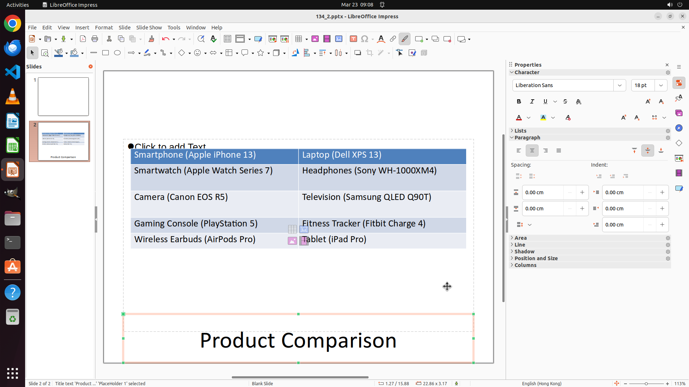

# Move the title of page 2 to the bottom of the slide.

[← LibreOffice Impress](../README.md) · [← Showcase](../../README.md)

## Task

> Move the title of page 2 to the bottom of the slide.

## Final state

## Artifacts

- [▶ Screen recording](recording.mp4) — full agent run
- [Trajectory](traj.jsonl) — per-step actions, reasoning, and screenshots
- [Runtime log](runtime.log)
- [Task definition](task.json) — original OSWorld task config
- Step screenshots: `step_*.png` in this folder

Task ID: `15aece23-a215-4579-91b4-69eec72e18da` · Domain: `libreoffice_impress` · Source: `https://arxiv.org/pdf/2311.01767.pdf`
