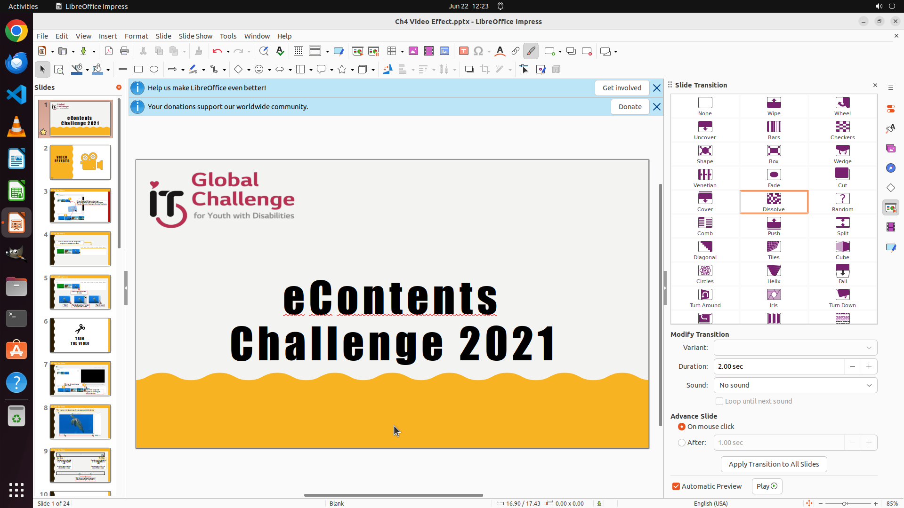

# Could you help me add slide transition "dissolve" to my first page?

[← LibreOffice Impress](../README.md) · [← Showcase](../../README.md)

## Task

> Could you help me add slide transition "dissolve" to my first page?

## Final state

## Artifacts

- [Trajectory](traj.jsonl) — per-step actions, reasoning, and screenshots
- [Runtime log](runtime.log)
- [Task definition](task.json) — original OSWorld task config
- Step screenshots: `step_*.png` in this folder

Task ID: `21760ecb-8f62-40d2-8d85-0cee5725cb72` · Domain: `libreoffice_impress` · Source: `https://www.libreofficehelp.com/add-animations-transitions-libreoffice-impress-slides/`
