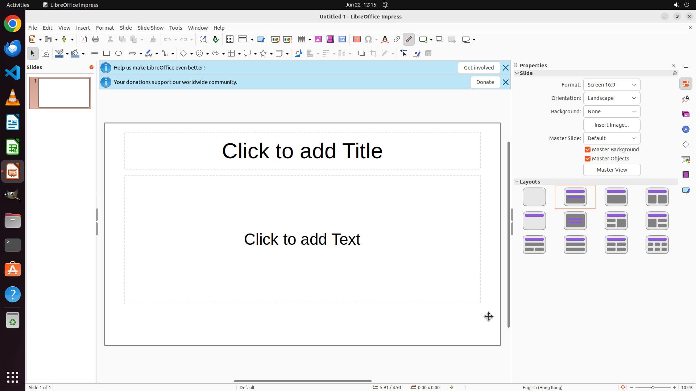

# Enable auto-save every 3min for me, so that I don't need to hit "ctrl-s" that much

[← LibreOffice Impress](../README.md) · [← Showcase](../../README.md)

## Task

> Enable auto-save every 3min for me, so that I don't need to hit "ctrl-s" that much

## Final state

## Artifacts

- [Trajectory](traj.jsonl) — per-step actions, reasoning, and screenshots
- [Runtime log](runtime.log)
- [Task definition](task.json) — original OSWorld task config
- Step screenshots: `step_*.png` in this folder

Task ID: `2cd43775-7085-45d8-89fa-9e35c0a915cf` · Domain: `libreoffice_impress` · Source: `https://www.libreofficehelp.com/enable-autosave-libreoffice/`
