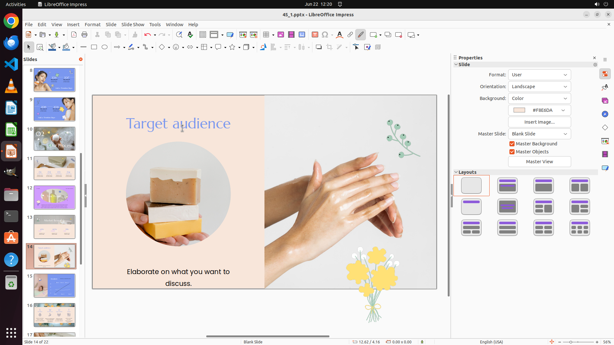

# Make the first textbox font size 60 pt while the second 28 pt on slide 14.

[← LibreOffice Impress](../README.md) · [← Showcase](../../README.md)

## Task

> Make the first textbox font size 60 pt while the second 28 pt on slide 14.

## Final state

## Artifacts

- [Trajectory](traj.jsonl) — per-step actions, reasoning, and screenshots
- [Runtime log](runtime.log)
- [Task definition](task.json) — original OSWorld task config
- Step screenshots: `step_*.png` in this folder

Task ID: `3161d64e-3120-47b4-aaad-6a764a92493b` · Domain: `libreoffice_impress` · Source: `https://arxiv.org/pdf/2311.01767.pdf`
