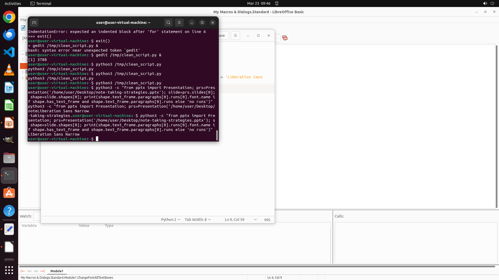

# Do you have any suggestions on how to modify the font for all text boxes in an Impress presentation?…

[← LibreOffice Impress](../README.md) · [← Showcase](../../README.md)

## Task

> Do you have any suggestions on how to modify the font for all text boxes in an Impress presentation? I want to standardize the font to 'Liberation Sans Narrow', but I don't want to manually select each individual text box.

## Final state

## Artifacts

- [▶ Screen recording](recording.mp4) — full agent run
- [Trajectory](traj.jsonl) — per-step actions, reasoning, and screenshots
- [Runtime log](runtime.log)
- [Task definition](task.json) — original OSWorld task config
- Step screenshots: `step_*.png` in this folder

Task ID: `358aa0a7-6677-453f-ae35-e440f004c31e` · Domain: `libreoffice_impress` · Source: `https://superuser.com/questions/296101/change-all-text-fonts-in-libreoffice-impress-presentation`
