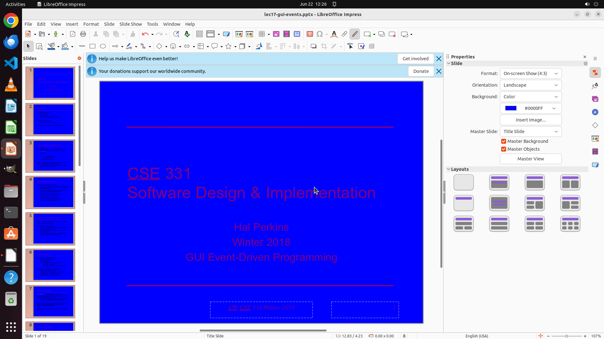

# Please make the background blue on all my slides. I was stuck by finding the entrance to do that for…

[← LibreOffice Impress](../README.md) · [← Showcase](../../README.md)

## Task

> Please make the background blue on all my slides. I was stuck by finding the entrance to do that for a while...

## Final state

## Artifacts

- [Trajectory](traj.jsonl) — per-step actions, reasoning, and screenshots
- [Runtime log](runtime.log)
- [Task definition](task.json) — original OSWorld task config
- Step screenshots: `step_*.png` in this folder

Task ID: `3b27600c-3668-4abd-8f84-7bcdebbccbdb` · Domain: `libreoffice_impress` · Source: `https://www.libreofficehelp.com/change-slide-background-impress/#All_Slides`
