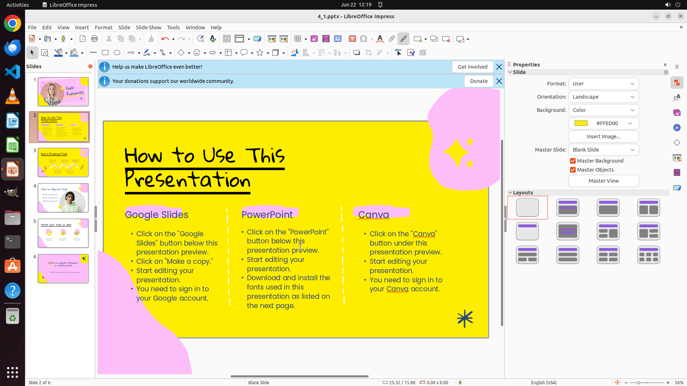

# Set the color of titles in slides 2,3,5 as black and underline them.

[← LibreOffice Impress](../README.md) · [← Showcase](../../README.md)

## Task

> Set the color of titles in slides 2,3,5 as black and underline them.

## Final state

## Artifacts

- [Trajectory](traj.jsonl) — per-step actions, reasoning, and screenshots
- [Runtime log](runtime.log)
- [Task definition](task.json) — original OSWorld task config
- Step screenshots: `step_*.png` in this folder

Task ID: `4ed5abd0-8b5d-47bd-839f-cacfa15ca37a` · Domain: `libreoffice_impress` · Source: `https://arxiv.org/pdf/2311.01767.pdf`
