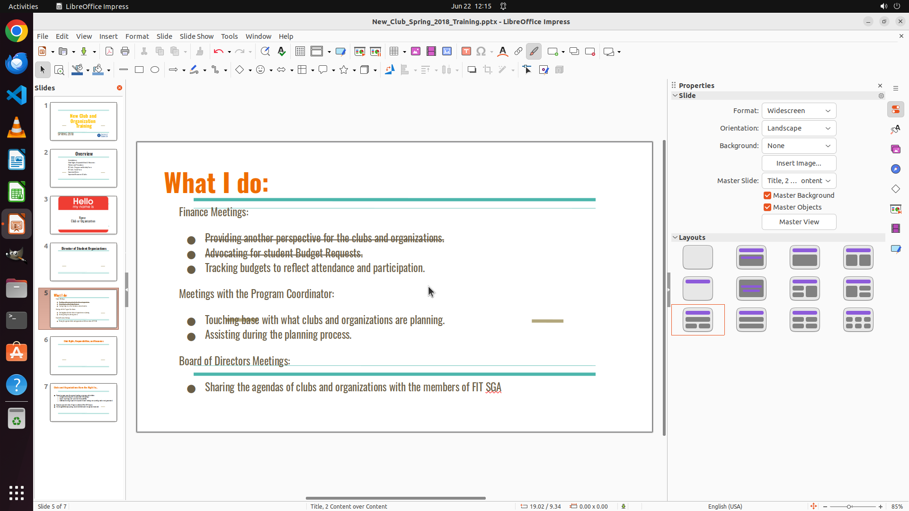

# I am checking our soccer club's to-do list for the last semester and adding strike-through sign on t…

[← LibreOffice Impress](../README.md) · [← Showcase](../../README.md)

## Task

> I am checking our soccer club's to-do list for the last semester and adding strike-through sign on the line we have already accomplished. Could you help me add a strike-through on the first and second line?

## Final state

## Artifacts

- [Trajectory](traj.jsonl) — per-step actions, reasoning, and screenshots
- [Runtime log](runtime.log)
- [Task definition](task.json) — original OSWorld task config
- Step screenshots: `step_*.png` in this folder

Task ID: `550ce7e7-747b-495f-b122-acdc4d0b8e54` · Domain: `libreoffice_impress` · Source: `https://technical-tips.com/blog/software/text-in-libreoffice-strikethrough--6948#:~:text=To%20strikethrough%20Text%20in%20LibreOffice%201%20In%20your,effect%22%20can%20your%20additionally%2C%20for%20example%2C%20double%20underline.`
