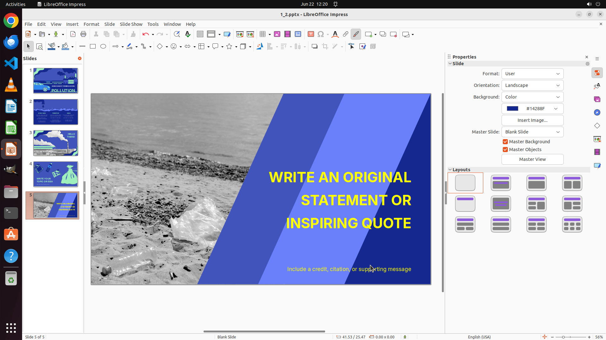

# Navigate to slide 5 and set the font color of all textboxes to yellow. Use exactly 'yellow'—no varia…

[← LibreOffice Impress](../README.md) · [← Showcase](../../README.md)

## Task

> Navigate to slide 5 and set the font color of all textboxes to yellow. Use exactly 'yellow'—no variations such as light yellow, dark yellow, or any other color.

## Final state

## Artifacts

- [Trajectory](traj.jsonl) — per-step actions, reasoning, and screenshots
- [Runtime log](runtime.log)
- [Task definition](task.json) — original OSWorld task config
- Step screenshots: `step_*.png` in this folder

Task ID: `57667013-ea97-417c-9dce-2713091e6e2a` · Domain: `libreoffice_impress` · Source: `https://arxiv.org/pdf/2311.01767.pdf`
