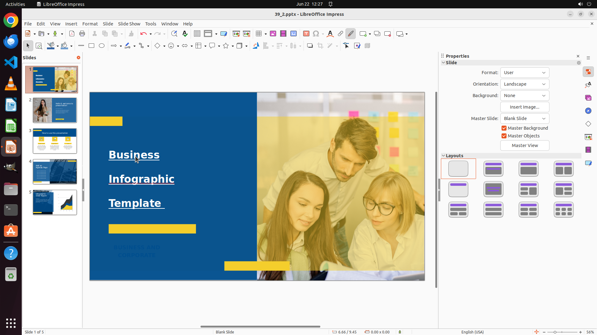

# Bold the text on slide 1. Make the title of size 44pt and underline it on slide 1.

[← LibreOffice Impress](../README.md) · [← Showcase](../../README.md)

## Task

> Bold the text on slide 1. Make the title of size 44pt and underline it on slide 1.

## Final state

## Artifacts

- [Trajectory](traj.jsonl) — per-step actions, reasoning, and screenshots
- [Runtime log](runtime.log)
- [Task definition](task.json) — original OSWorld task config
- Step screenshots: `step_*.png` in this folder

Task ID: `5c1a6c3d-c1b3-47cb-9b01-8d1b7544ffa1` · Domain: `libreoffice_impress` · Source: `https://arxiv.org/pdf/2311.01767.pdf`
