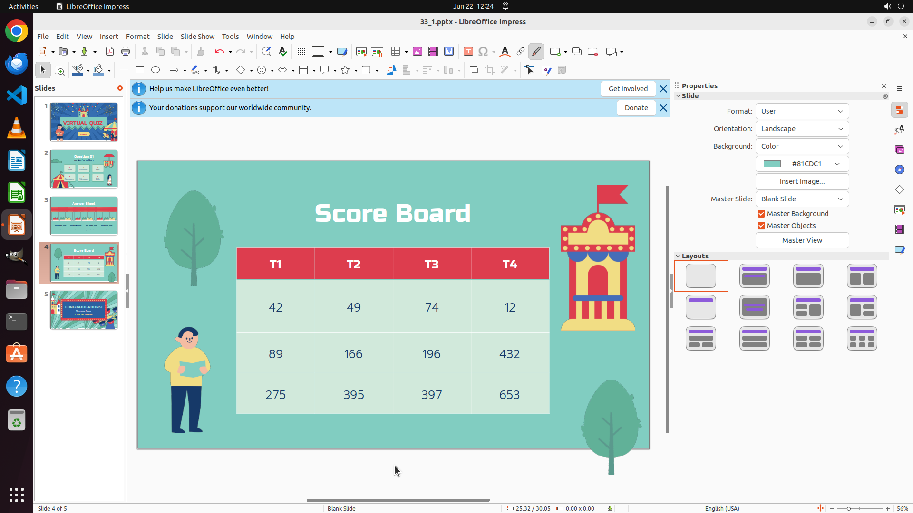

# Change the first row of table to "T1","T2","T3","T4" on slide 4.

[← LibreOffice Impress](../README.md) · [← Showcase](../../README.md)

## Task

> Change the first row of table to "T1","T2","T3","T4" on slide 4.

## Final state

## Artifacts

- [Trajectory](traj.jsonl) — per-step actions, reasoning, and screenshots
- [Runtime log](runtime.log)
- [Task definition](task.json) — original OSWorld task config
- Step screenshots: `step_*.png` in this folder

Task ID: `5cfb9197-e72b-454b-900e-c06b0c802b40` · Domain: `libreoffice_impress` · Source: `https://arxiv.org/pdf/2311.01767.pdf`
