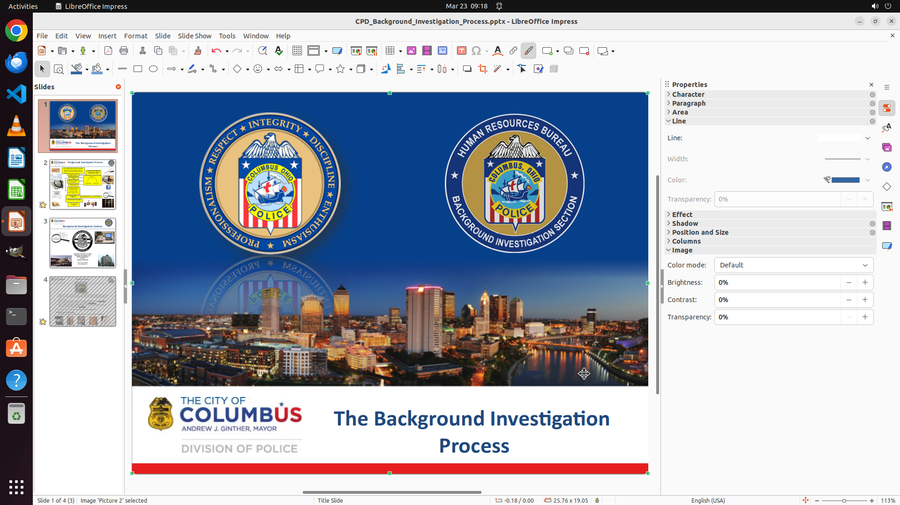

# I want to turn the rectangular image of Columbus on the first page into a cover page. Could you help…

[← LibreOffice Impress](../README.md) · [← Showcase](../../README.md)

## Task

> I want to turn the rectangular image of Columbus on the first page into a cover page. Could you help me stretch this image to fill the entire page, keeping its proportion and centering the image?

## Final state

## Artifacts

- [▶ Screen recording](recording.mp4) — full agent run
- [Trajectory](traj.jsonl) — per-step actions, reasoning, and screenshots
- [Runtime log](runtime.log)
- [Task definition](task.json) — original OSWorld task config
- Step screenshots: `step_*.png` in this folder

Task ID: `5d901039-a89c-4bfb-967b-bf66f4df075e` · Domain: `libreoffice_impress` · Source: `https://superuser.com/questions/986776/how-can-i-stretch-an-image-in-a-libreoffice-impress-presentation-to-fill-the-pag`
