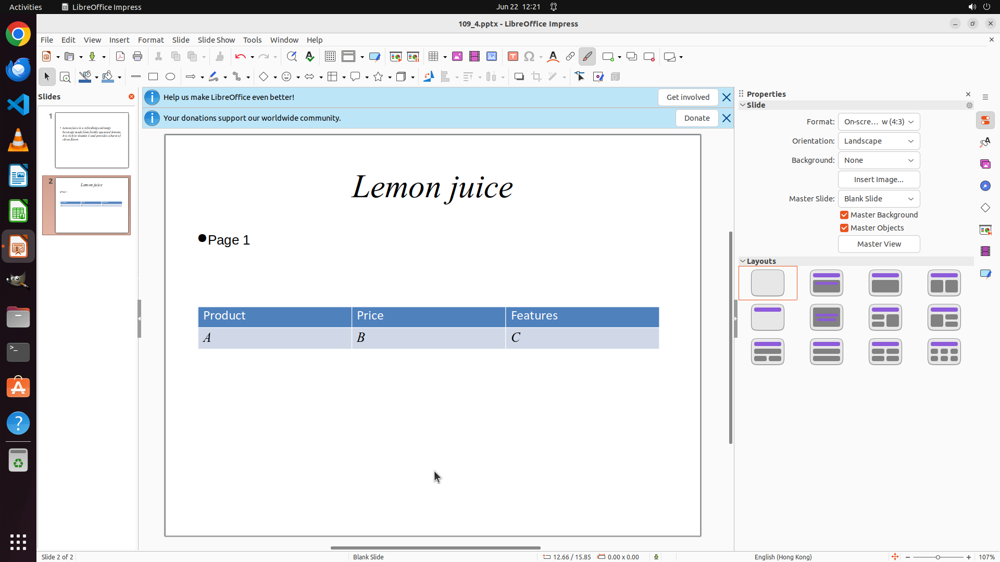

# Add "Page 1" into the content textbox on Slide 2.

[← LibreOffice Impress](../README.md) · [← Showcase](../../README.md)

## Task

> Add "Page 1" into the content textbox on Slide 2.

## Final state

## Artifacts

- [Trajectory](traj.jsonl) — per-step actions, reasoning, and screenshots
- [Runtime log](runtime.log)
- [Task definition](task.json) — original OSWorld task config
- Step screenshots: `step_*.png` in this folder

Task ID: `73c99fb9-f828-43ce-b87a-01dc07faa224` · Domain: `libreoffice_impress` · Source: `https://arxiv.org/pdf/2311.01767.pdf`
