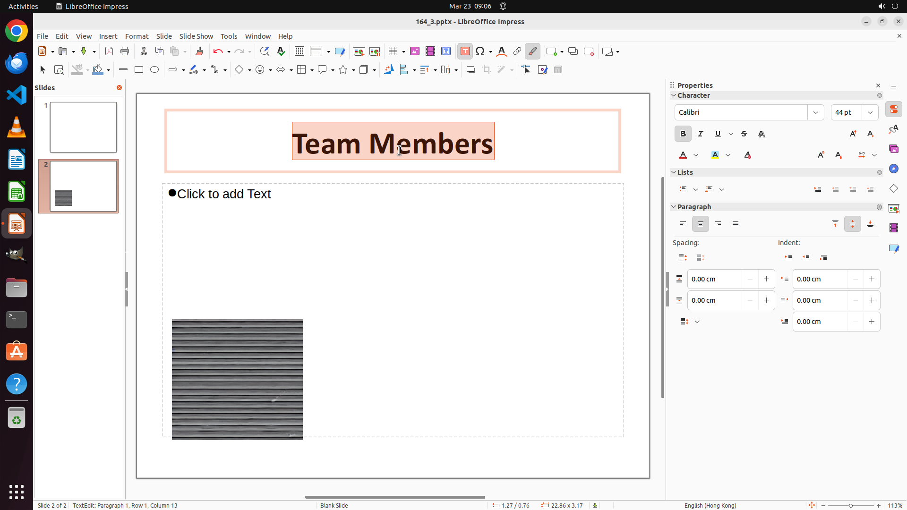

# On page 2, add a note same to the title into the slide. Make the font of title bold.

[← LibreOffice Impress](../README.md) · [← Showcase](../../README.md)

## Task

> On page 2, add a note same to the title into the slide. Make the font of title bold.

## Final state

## Artifacts

- [▶ Screen recording](recording.mp4) — full agent run
- [Trajectory](traj.jsonl) — per-step actions, reasoning, and screenshots
- [Runtime log](runtime.log)
- [Task definition](task.json) — original OSWorld task config
- Step screenshots: `step_*.png` in this folder

Task ID: `7dbc52a6-11e0-4c9a-a2cb-1e36cfda80d8` · Domain: `libreoffice_impress` · Source: `https://arxiv.org/pdf/2311.01767.pdf`
