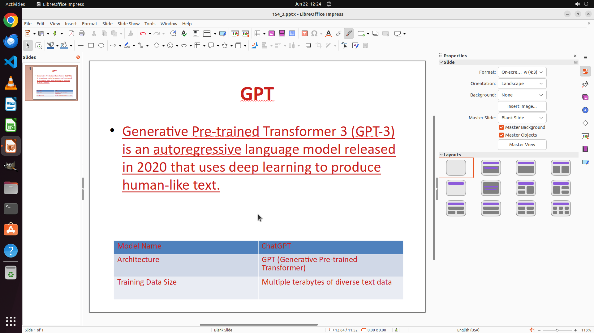

# Underline the body of the slide only (without title and table) in dark red 2, and change the font co…

[← LibreOffice Impress](../README.md) · [← Showcase](../../README.md)

## Task

> Underline the body of the slide only (without title and table) in dark red 2, and change the font color of the whole slide (title, body and table) to dark red 2.

## Final state

## Artifacts

- [Trajectory](traj.jsonl) — per-step actions, reasoning, and screenshots
- [Runtime log](runtime.log)
- [Task definition](task.json) — original OSWorld task config
- Step screenshots: `step_*.png` in this folder

Task ID: `986fc832-6af2-417c-8845-9272b3a1528b` · Domain: `libreoffice_impress` · Source: `https://arxiv.org/pdf/2311.01767.pdf`
