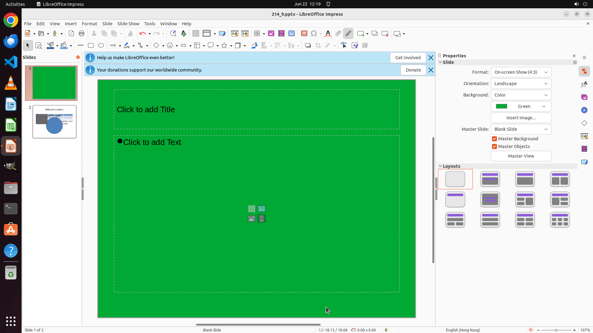

# Move to slide 1 and give it a green background color.

[← LibreOffice Impress](../README.md) · [← Showcase](../../README.md)

## Task

> Move to slide 1 and give it a green background color.

## Final state

## Artifacts

- [Trajectory](traj.jsonl) — per-step actions, reasoning, and screenshots
- [Runtime log](runtime.log)
- [Task definition](task.json) — original OSWorld task config
- Step screenshots: `step_*.png` in this folder

Task ID: `9cf05d24-6bd9-4dae-8967-f67d88f5d38a` · Domain: `libreoffice_impress` · Source: `https://arxiv.org/pdf/2311.01767.pdf`
