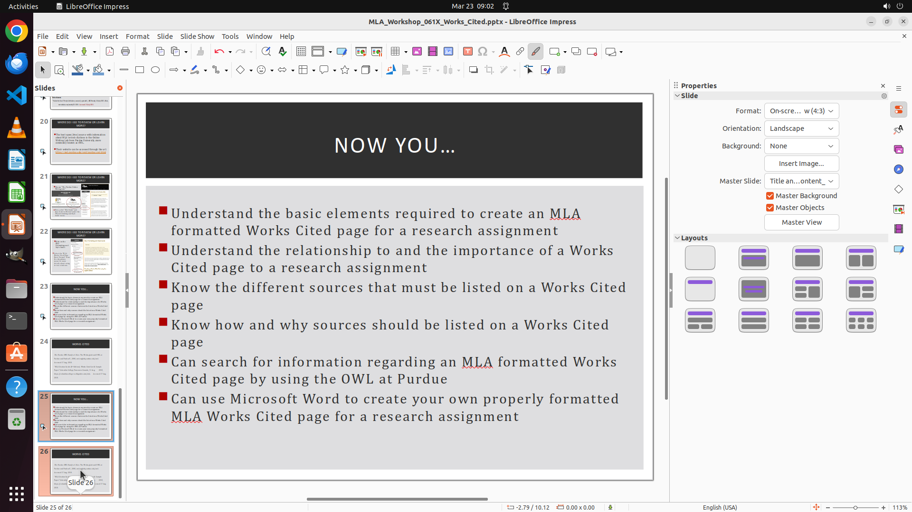

# Please duplicate the last two slides and insert the copies in alternating order, so the sequence bec…

[← LibreOffice Impress](../README.md) · [← Showcase](../../README.md)

## Task

> Please duplicate the last two slides and insert the copies in alternating order, so the sequence becomes: original slide A, original slide B, then duplicated slide A, duplicated slide B.

## Final state

## Artifacts

- [▶ Screen recording](recording.mp4) — full agent run
- [Trajectory](traj.jsonl) — per-step actions, reasoning, and screenshots
- [Runtime log](runtime.log)
- [Task definition](task.json) — original OSWorld task config
- Step screenshots: `step_*.png` in this folder

Task ID: `9ec204e4-f0a3-42f8-8458-b772a6797cab` · Domain: `libreoffice_impress` · Source: `https://www.tiktok.com/@lil.d1rt_/video/7247574148887629083`
