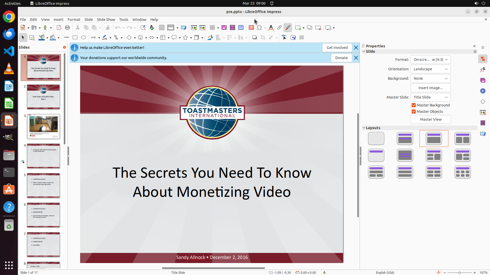

# Could you help me save my slides as pre.pptx on the Desktop?

[← LibreOffice Impress](../README.md) · [← Showcase](../../README.md)

## Task

> Could you help me save my slides as pre.pptx on the Desktop?

## Final state

## Artifacts

- [▶ Screen recording](recording.mp4) — full agent run
- [Trajectory](traj.jsonl) — per-step actions, reasoning, and screenshots
- [Runtime log](runtime.log)
- [Task definition](task.json) — original OSWorld task config
- Step screenshots: `step_*.png` in this folder

Task ID: `a097acff-6266-4291-9fbd-137af7ecd439` · Domain: `libreoffice_impress` · Source: `https://www.youtube.com/watch?v=DDmEvjs4iBw`
