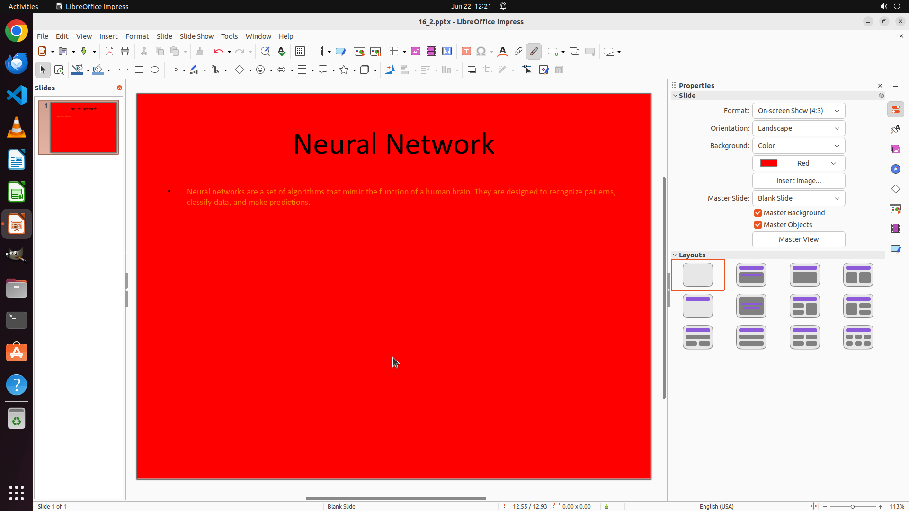

# Change the font size of the content to 12, and change the font color to orange. Change the slide's b…

[← LibreOffice Impress](../README.md) · [← Showcase](../../README.md)

## Task

> Change the font size of the content to 12, and change the font color to orange. Change the slide's background to red.

## Final state

## Artifacts

- [Trajectory](traj.jsonl) — per-step actions, reasoning, and screenshots
- [Runtime log](runtime.log)
- [Task definition](task.json) — original OSWorld task config
- Step screenshots: `step_*.png` in this folder

Task ID: `a434992a-89df-4577-925c-0c58b747f0f4` · Domain: `libreoffice_impress` · Source: `https://arxiv.org/pdf/2311.01767.pdf`
