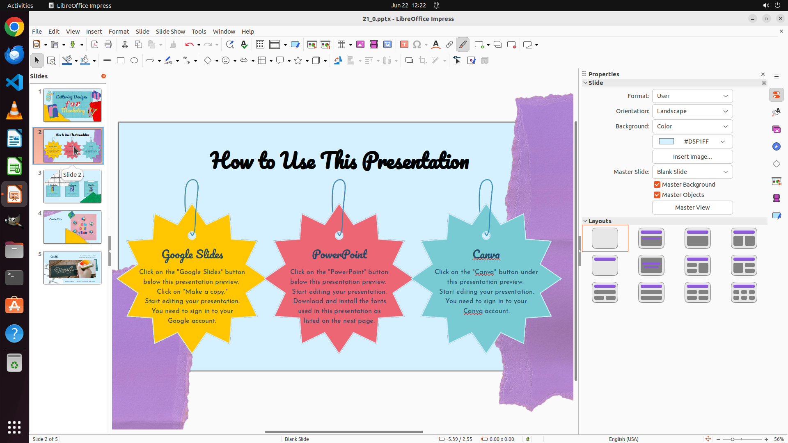

# Set the font color of the title in slides 2 to 3 as black and bold the title. Also, delete the perso…

[← LibreOffice Impress](../README.md) · [← Showcase](../../README.md)

## Task

> Set the font color of the title in slides 2 to 3 as black and bold the title. Also, delete the personal information (including the icons)in slide 4.

## Final state

## Artifacts

- [Trajectory](traj.jsonl) — per-step actions, reasoning, and screenshots
- [Runtime log](runtime.log)
- [Task definition](task.json) — original OSWorld task config
- Step screenshots: `step_*.png` in this folder

Task ID: `a53f80cd-4a90-4490-8310-097b011433f6` · Domain: `libreoffice_impress` · Source: `https://arxiv.org/pdf/2311.01767.pdf`
