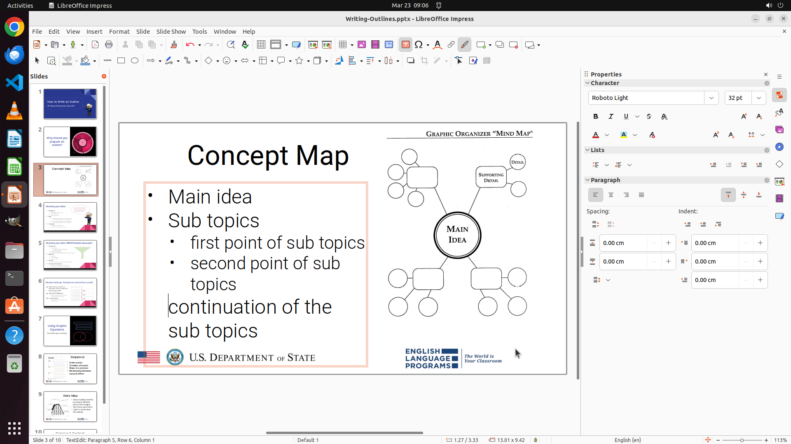

# I want to do something like the following on Page 3 of the current LibreOffice Impress file: make th…

[← LibreOffice Impress](../README.md) · [← Showcase](../../README.md)

## Task

> I want to do something like the following on Page 3 of the current LibreOffice Impress file: make the "continuation of the sub topics" indented the same as "main idea" and "sub topics" without a bullet in front of it. Could you help me with it?

## Final state

## Artifacts

- [▶ Screen recording](recording.mp4) — full agent run
- [Trajectory](traj.jsonl) — per-step actions, reasoning, and screenshots
- [Runtime log](runtime.log)
- [Task definition](task.json) — original OSWorld task config
- Step screenshots: `step_*.png` in this folder

Task ID: `a669ef01-ded5-4099-9ea9-25e99b569840` · Domain: `libreoffice_impress` · Source: `https://superuser.com/questions/1628656/in-libreoffice-impress-how-can-i-have-a-bullet-indentation-no-bullet-item`
