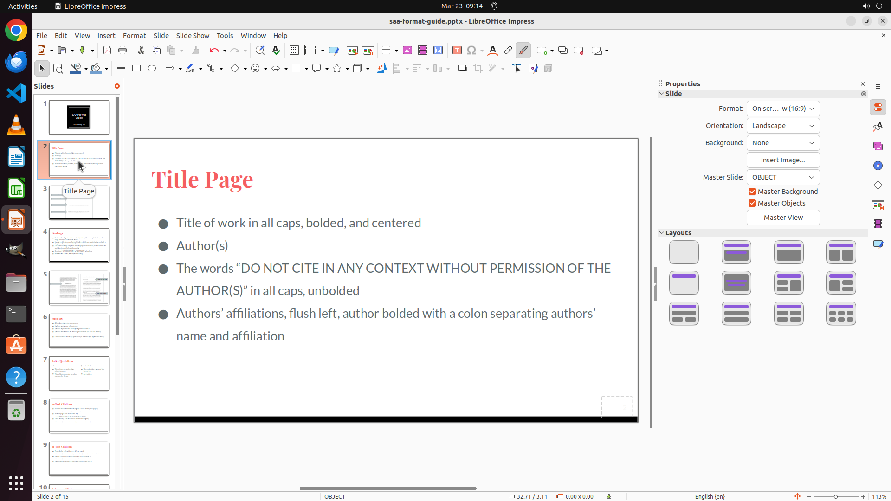

# I am preparing a PPT in Libreoffice impress. The slide number is barely visible to me. Please help m…

[← LibreOffice Impress](../README.md) · [← Showcase](../../README.md)

## Task

> I am preparing a PPT in Libreoffice impress. The slide number is barely visible to me. Please help me change the color of the slide number to red?

## Final state

## Artifacts

- [▶ Screen recording](recording.mp4) — full agent run
- [Trajectory](traj.jsonl) — per-step actions, reasoning, and screenshots
- [Runtime log](runtime.log)
- [Task definition](task.json) — original OSWorld task config
- Step screenshots: `step_*.png` in this folder

Task ID: `ac9bb6cb-1888-43ab-81e4-a98a547918cd` · Domain: `libreoffice_impress` · Source: `https://superuser.com/questions/1674211/how-to-change-colour-of-slide-number-in-libre-office`
