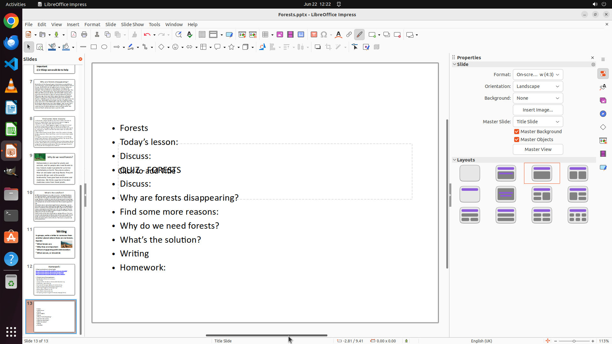

# I am making PPT on LibreOffice Impress for presentation tomorrow. I need to summarize contents on on…

[← LibreOffice Impress](../README.md) · [← Showcase](../../README.md)

## Task

> I am making PPT on LibreOffice Impress for presentation tomorrow. I need to summarize contents on one slide use Impress "Summary Slide" feature. Could you make that for me?

## Final state

## Artifacts

- [Trajectory](traj.jsonl) — per-step actions, reasoning, and screenshots
- [Runtime log](runtime.log)
- [Task definition](task.json) — original OSWorld task config
- Step screenshots: `step_*.png` in this folder

Task ID: `af23762e-2bfd-4a1d-aada-20fa8de9ce07` · Domain: `libreoffice_impress` · Source: `https://superuser.com/questions/1059080/how-to-make-a-summary-slide-in-impress-listing-the-titles-of-all-slides-autom`
