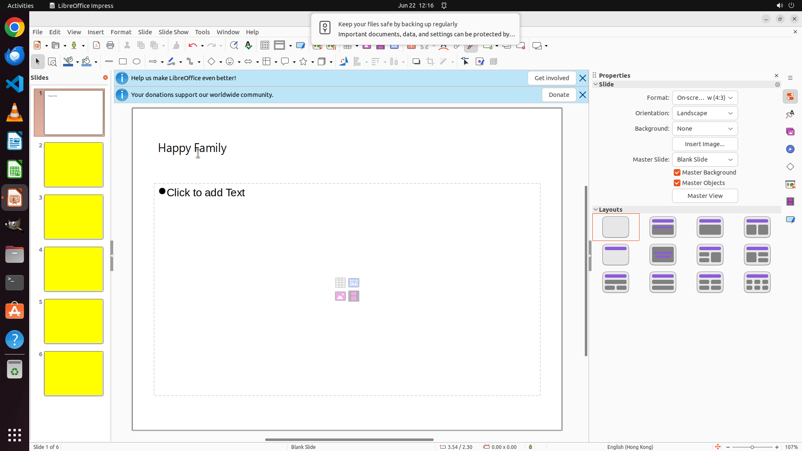

# In the first slide, insert the title "Happy Family" and make the font style "Microsoft JhengHei".

[← LibreOffice Impress](../README.md) · [← Showcase](../../README.md)

## Task

> In the first slide, insert the title "Happy Family" and make the font style "Microsoft JhengHei".

## Final state

## Artifacts

- [Trajectory](traj.jsonl) — per-step actions, reasoning, and screenshots
- [Runtime log](runtime.log)
- [Task definition](task.json) — original OSWorld task config
- Step screenshots: `step_*.png` in this folder

Task ID: `af2d657a-e6b3-4c6a-9f67-9e3ed015974c` · Domain: `libreoffice_impress` · Source: `https://arxiv.org/pdf/2311.01767.pdf`
