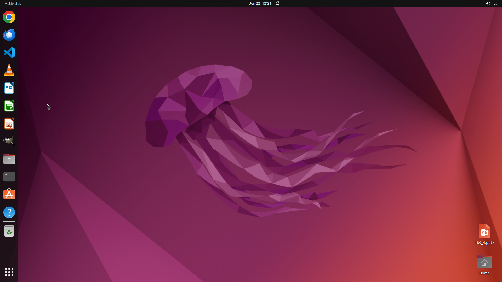

# Go to the second slide and name its title as "Online Shopping" with the same color, position and fon…

[← LibreOffice Impress](../README.md) · [← Showcase](../../README.md)

## Task

> Go to the second slide and name its title as "Online Shopping" with the same color, position and font size as the previous title.

## Final state

## Artifacts

- [Trajectory](traj.jsonl) — per-step actions, reasoning, and screenshots
- [Runtime log](runtime.log)
- [Task definition](task.json) — original OSWorld task config
- Step screenshots: `step_*.png` in this folder

Task ID: `b8adbc24-cef2-4b15-99d5-ecbe7ff445eb` · Domain: `libreoffice_impress` · Source: `https://arxiv.org/pdf/2311.01767.pdf`
