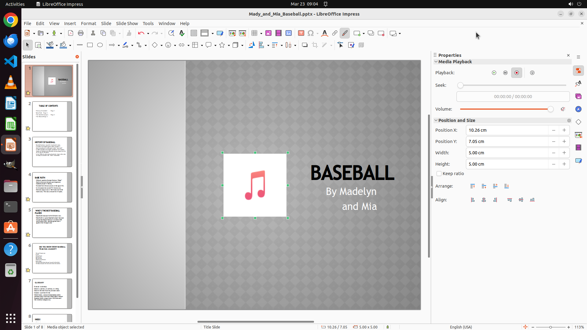

# I am making PPT about the history of baseball. I want to add an introduction audio named "Baseball.m…

[← LibreOffice Impress](../README.md) · [← Showcase](../../README.md)

## Task

> I am making PPT about the history of baseball. I want to add an introduction audio named "Baseball.mp3" on the Desktop into my PPT, but I do not know how. Could you help me add audio into my presentation file?

## Final state

## Artifacts

- [Trajectory](traj.jsonl) — per-step actions, reasoning, and screenshots
- [Runtime log](runtime.log)
- [Task definition](task.json) — original OSWorld task config
- Step screenshots: `step_*.png` in this folder

Task ID: `c59742c0-4323-4b9d-8a02-723c251deaa0` · Domain: `libreoffice_impress` · Source: `https://www.reddit.com/r/libreoffice/comments/17lcdrp/audio_not_supported_in_libreoffice_impress/`
