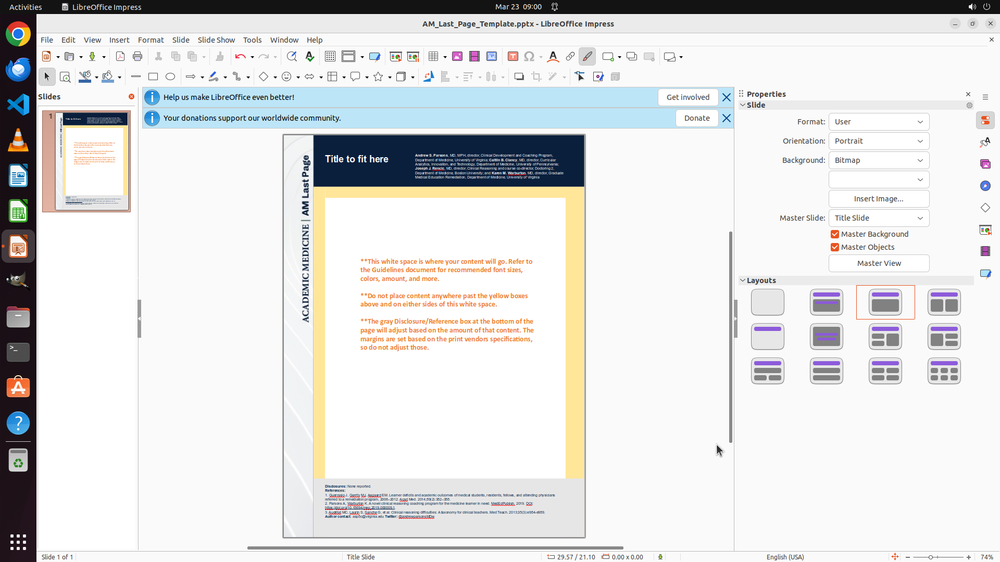

# Please set my slides upright instead of sideways.

[← LibreOffice Impress](../README.md) · [← Showcase](../../README.md)

## Task

> Please set my slides upright instead of sideways.

## Final state

## Artifacts

- [▶ Screen recording](recording.mp4) — full agent run
- [Trajectory](traj.jsonl) — per-step actions, reasoning, and screenshots
- [Runtime log](runtime.log)
- [Task definition](task.json) — original OSWorld task config
- Step screenshots: `step_*.png` in this folder

Task ID: `ce88f674-ab7a-43da-9201-468d38539e4a` · Domain: `libreoffice_impress` · Source: `https://justclickhere.co.uk/resources/change-slides-in-impress-to-portrait/`
