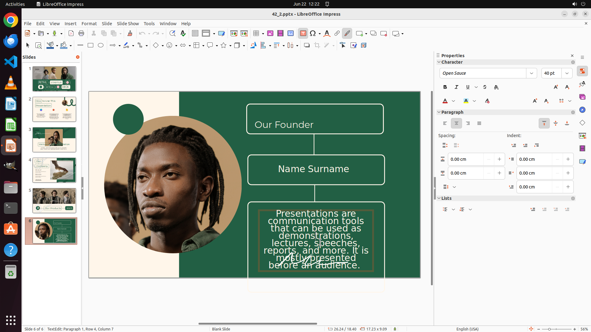

# The height of picture should be 20cm on slide 3 while the font size of all textboxes should be 40pt …

[← LibreOffice Impress](../README.md) · [← Showcase](../../README.md)

## Task

> The height of picture should be 20cm on slide 3 while the font size of all textboxes should be 40pt on slide 6.

## Final state

## Artifacts

- [Trajectory](traj.jsonl) — per-step actions, reasoning, and screenshots
- [Runtime log](runtime.log)
- [Task definition](task.json) — original OSWorld task config
- Step screenshots: `step_*.png` in this folder

Task ID: `e4ef0baf-4b52-4590-a47e-d4d464cca2d7` · Domain: `libreoffice_impress` · Source: `https://arxiv.org/pdf/2311.01767.pdf`
