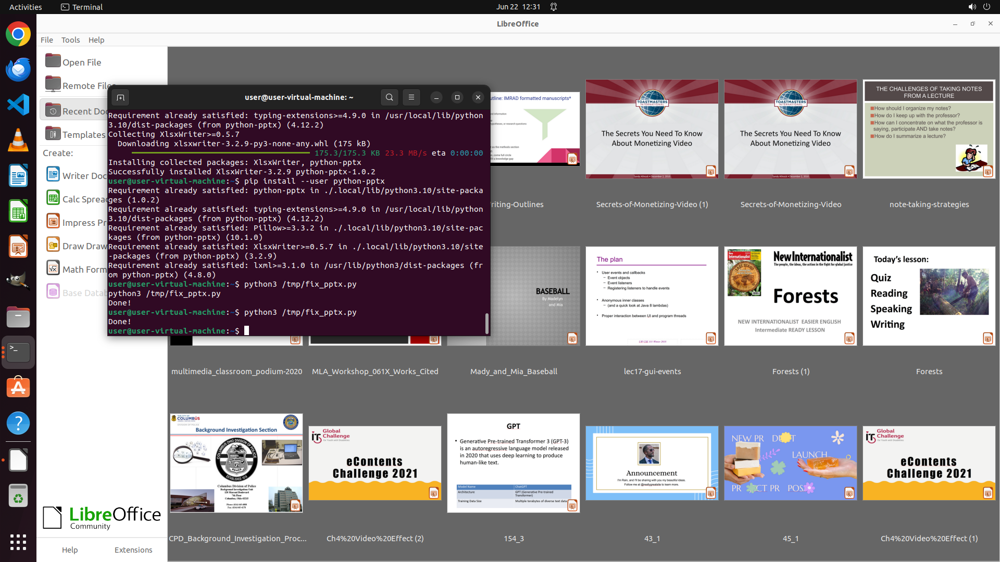

# Move the picture on page 2 to slide top. Make textboxes underlined on slide 1 and 2.

[← LibreOffice Impress](../README.md) · [← Showcase](../../README.md)

## Task

> Move the picture on page 2 to slide top. Make textboxes underlined on slide 1 and 2.

## Final state

## Artifacts

- [Trajectory](traj.jsonl) — per-step actions, reasoning, and screenshots
- [Runtime log](runtime.log)
- [Task definition](task.json) — original OSWorld task config
- Step screenshots: `step_*.png` in this folder

Task ID: `ed43c15f-00cb-4054-9c95-62c880865d68` · Domain: `libreoffice_impress` · Source: `https://arxiv.org/pdf/2311.01767.pdf`
