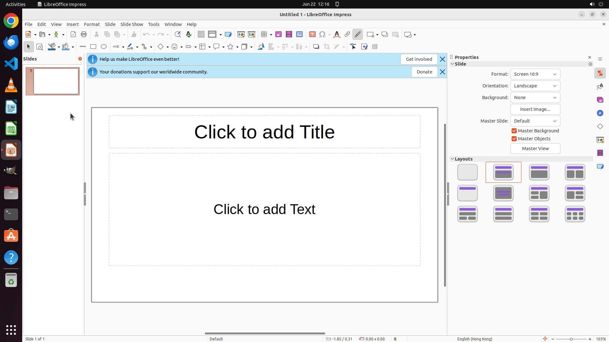

# I closed the slide panel on the left and idk how to get it back please help. Please restore the left…

[← LibreOffice Impress](../README.md) · [← Showcase](../../README.md)

## Task

> I closed the slide panel on the left and idk how to get it back please help. Please restore the left slide panel so it becomes visible again.

## Final state

## Artifacts

- [Trajectory](traj.jsonl) — per-step actions, reasoning, and screenshots
- [Runtime log](runtime.log)
- [Task definition](task.json) — original OSWorld task config
- Step screenshots: `step_*.png` in this folder

Task ID: `ef9d12bd-bcee-4ba0-a40e-918400f43ddf` · Domain: `libreoffice_impress` · Source: `https://www.reddit.com/r/libreoffice/comments/18elh3y/i_closed_the_slide_pannel_on_the_left_and_idk_how/`
