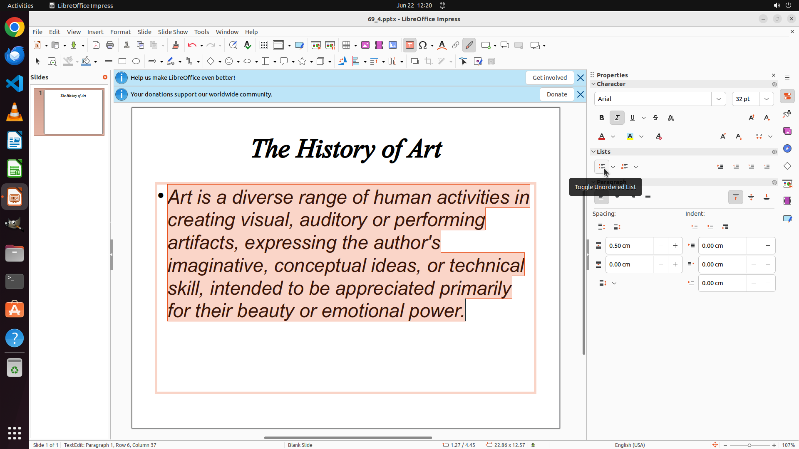

# Add a bullet point to the content of this slide.

[← LibreOffice Impress](../README.md) · [← Showcase](../../README.md)

## Task

> Add a bullet point to the content of this slide.

## Final state

## Artifacts

- [Trajectory](traj.jsonl) — per-step actions, reasoning, and screenshots
- [Runtime log](runtime.log)
- [Task definition](task.json) — original OSWorld task config
- Step screenshots: `step_*.png` in this folder

Task ID: `f23acfd2-c485-4b7c-a1e7-d4303ddfe864` · Domain: `libreoffice_impress` · Source: `https://arxiv.org/pdf/2311.01767.pdf`
