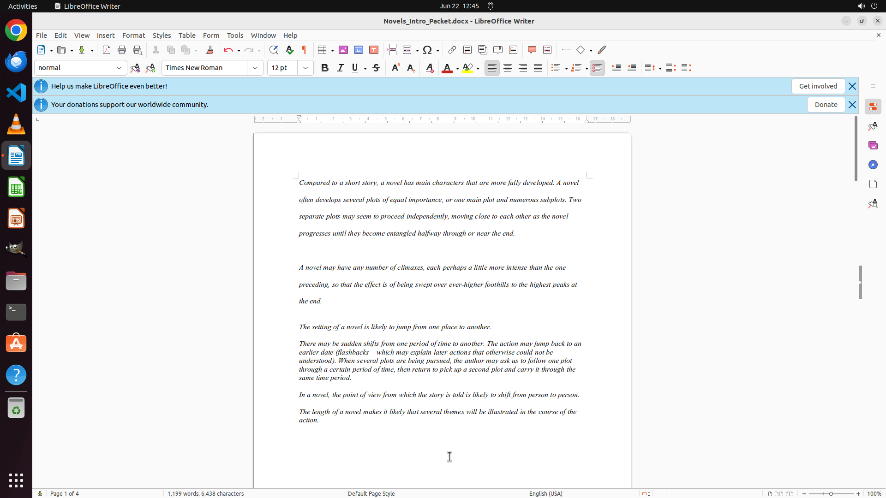

# Make the line spacing of first two paragraph into double line spacing

[← LibreOffice Writer](../README.md) · [← Showcase](../../README.md)

## Task

> Make the line spacing of first two paragraph into double line spacing

## Final state

## Artifacts

- [Trajectory](traj.jsonl) — per-step actions, reasoning, and screenshots
- [Runtime log](runtime.log)
- [Task definition](task.json) — original OSWorld task config
- Step screenshots: `step_*.png` in this folder

Task ID: `0810415c-bde4-4443-9047-d5f70165a697` · Domain: `libreoffice_writer` · Source: `https://www.youtube.com/watch?v=Q_AaL6ljudU`
