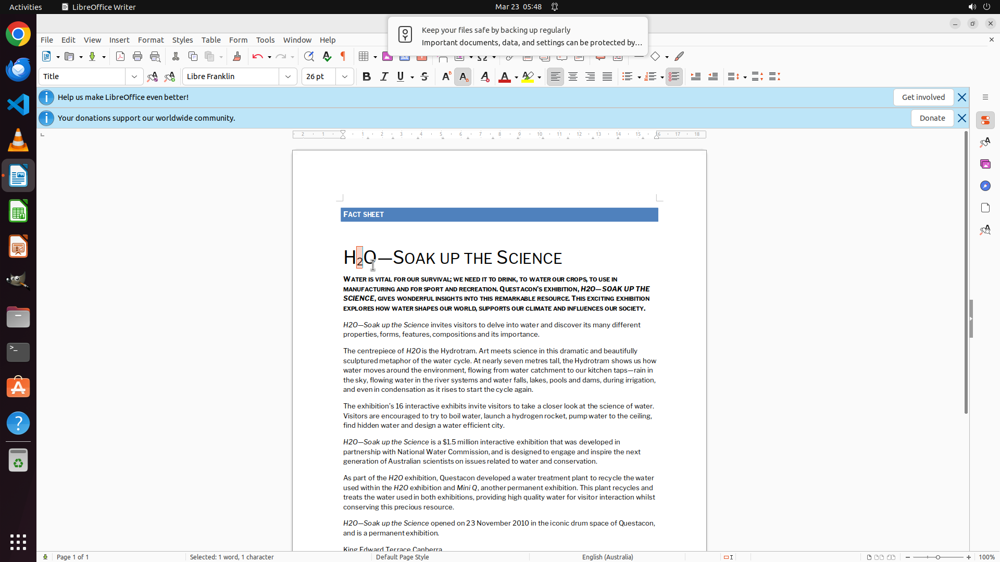

# Help me change the 2 in "H2O" to a subscript.

[← LibreOffice Writer](../README.md) · [← Showcase](../../README.md)

## Task

> Help me change the 2 in "H2O" to a subscript.

## Final state

## Artifacts

- [▶ Screen recording](recording.mp4) — full agent run
- [Trajectory](traj.jsonl) — per-step actions, reasoning, and screenshots
- [Runtime log](runtime.log)
- [Task definition](task.json) — original OSWorld task config
- Step screenshots: `step_*.png` in this folder

Task ID: `0b17a146-2934-46c7-8727-73ff6b6483e8` · Domain: `libreoffice_writer` · Source: `https://askubuntu.com/questions/245695/how-do-you-insert-subscripts-and-superscripts-into-ordinary-non-formula-text-i`
