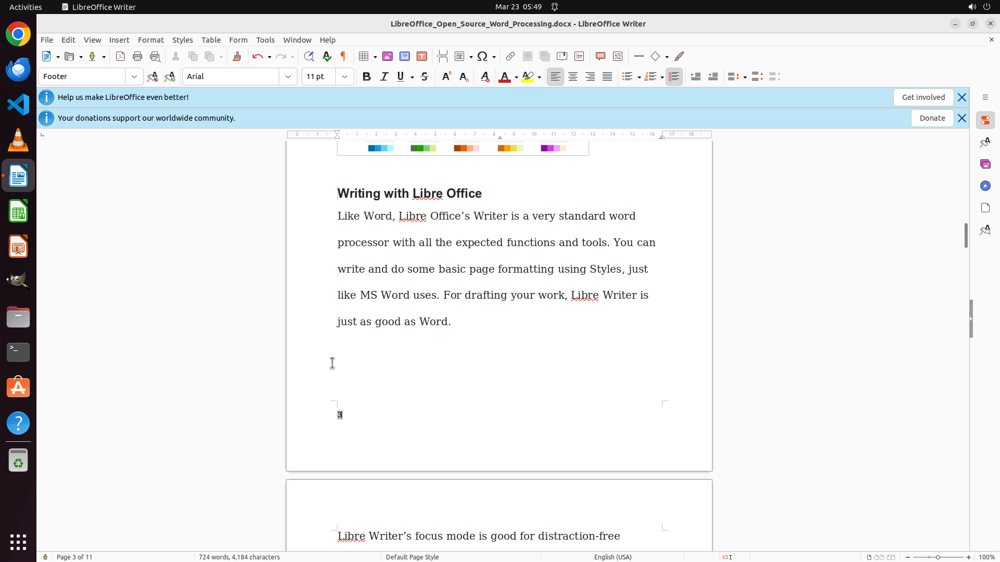

# Add page number for every page at the bottom left

[← LibreOffice Writer](../README.md) · [← Showcase](../../README.md)

## Task

> Add page number for every page at the bottom left

## Final state

## Artifacts

- [▶ Screen recording](recording.mp4) — full agent run
- [Trajectory](traj.jsonl) — per-step actions, reasoning, and screenshots
- [Runtime log](runtime.log)
- [Task definition](task.json) — original OSWorld task config
- Step screenshots: `step_*.png` in this folder

Task ID: `0e47de2a-32e0-456c-a366-8c607ef7a9d2` · Domain: `libreoffice_writer` · Source: `https://ask.libreoffice.org/t/how-to-start-page-numbering-on-a-certain-page/39931/4`
