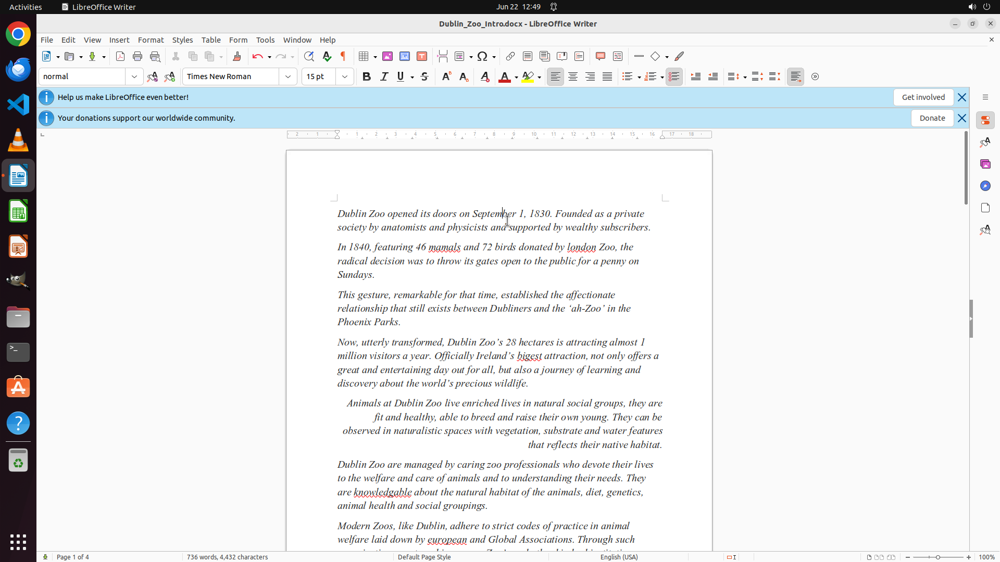

# Change the font to "Times New Roman" throughout the text.

[← LibreOffice Writer](../README.md) · [← Showcase](../../README.md)

## Task

> Change the font to "Times New Roman" throughout the text.

## Final state

## Artifacts

- [Trajectory](traj.jsonl) — per-step actions, reasoning, and screenshots
- [Runtime log](runtime.log)
- [Task definition](task.json) — original OSWorld task config
- Step screenshots: `step_*.png` in this folder

Task ID: `0e763496-b6bb-4508-a427-fad0b6c3e195` · Domain: `libreoffice_writer` · Source: `https://ask.libreoffice.org/t/how-do-i-change-the-font-for-the-whole-document-in-writer/9220`
