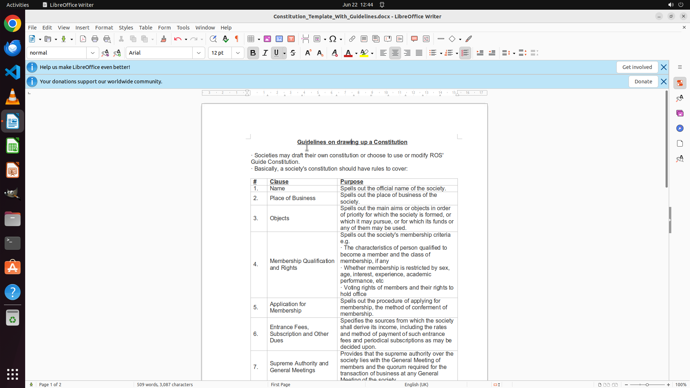

# Help me center align the heading in LibreOffice.

[← LibreOffice Writer](../README.md) · [← Showcase](../../README.md)

## Task

> Help me center align the heading in LibreOffice.

## Final state

## Artifacts

- [Trajectory](traj.jsonl) — per-step actions, reasoning, and screenshots
- [Runtime log](runtime.log)
- [Task definition](task.json) — original OSWorld task config
- Step screenshots: `step_*.png` in this folder

Task ID: `3ef2b351-8a84-4ff2-8724-d86eae9b842e` · Domain: `libreoffice_writer` · Source: `https://askubuntu.com/questions/1066351/how-do-you-center-align-in-libreoffice#:~:text=Ctrl%20%2B%20e%20will%20Center%20align%20the%20cursor%20for%20you.`
