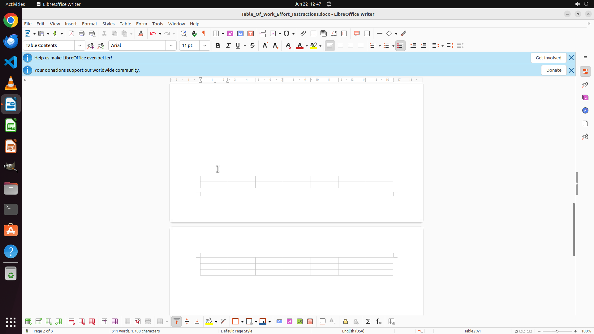

# Could you help me insert a 7(columns)*5(rows) empty table at the point of cursor?

[← LibreOffice Writer](../README.md) · [← Showcase](../../README.md)

## Task

> Could you help me insert a 7(columns)*5(rows) empty table at the point of cursor?

## Final state

## Artifacts

- [Trajectory](traj.jsonl) — per-step actions, reasoning, and screenshots
- [Runtime log](runtime.log)
- [Task definition](task.json) — original OSWorld task config
- Step screenshots: `step_*.png` in this folder

Task ID: `66399b0d-8fda-4618-95c4-bfc6191617e9` · Domain: `libreoffice_writer` · Source: `https://help.libreoffice.org/latest/en-US/text/swriter/guide/table_insert.html`
