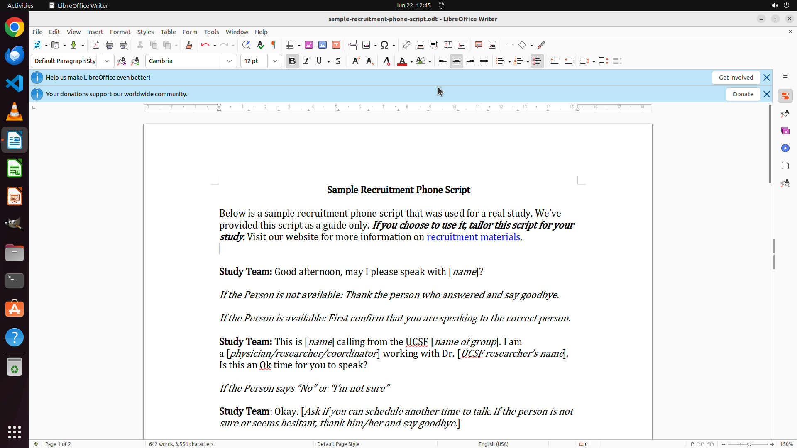

# I have been editing my document and some words that needed to be rewritten are highlighted in yellow…

[← LibreOffice Writer](../README.md) · [← Showcase](../../README.md)

## Task

> I have been editing my document and some words that needed to be rewritten are highlighted in yellow. As I fixed those words, please help me remove all highlight. I want to make sure that there is no highlight word.

## Final state

## Artifacts

- [Trajectory](traj.jsonl) — per-step actions, reasoning, and screenshots
- [Runtime log](runtime.log)
- [Task definition](task.json) — original OSWorld task config
- Step screenshots: `step_*.png` in this folder

Task ID: `6a33f9b9-0a56-4844-9c3f-96ec3ffb3ba2` · Domain: `libreoffice_writer` · Source: `https://help.libreoffice.org/7.2/en-US/text/shared/02/02160000.html?&DbPAR=WRITER&System=WIN#:~:text=Select%20the%20highlighted%20text.%20On%20the%20Formatting%20bar%2C,by%20clicking%20the%20icon%20again%20or%20pressing%20Esc.`
