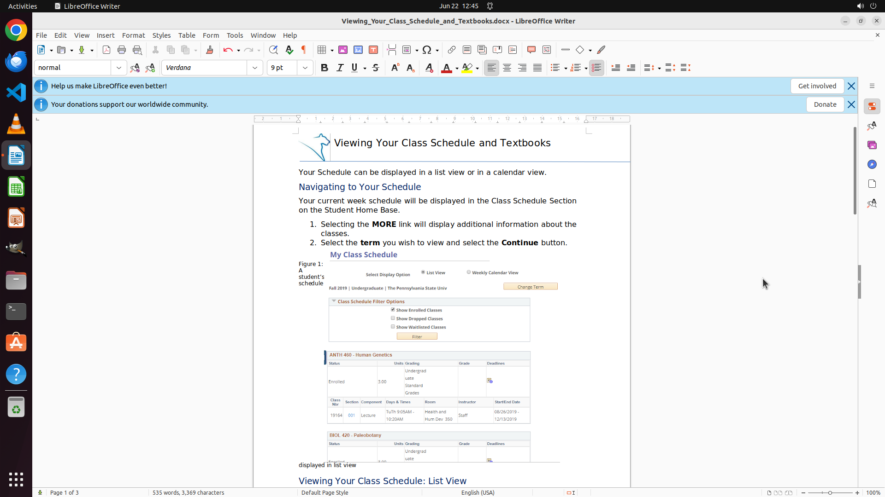

# Copy the screenshot 1.png from the desktop to where my cursor is located

[← LibreOffice Writer](../README.md) · [← Showcase](../../README.md)

## Task

> Copy the screenshot 1.png from the desktop to where my cursor is located

## Final state

## Artifacts

- [Trajectory](traj.jsonl) — per-step actions, reasoning, and screenshots
- [Runtime log](runtime.log)
- [Task definition](task.json) — original OSWorld task config
- Step screenshots: `step_*.png` in this folder

Task ID: `6ada715d-3aae-4a32-a6a7-429b2e43fb93` · Domain: `libreoffice_writer` · Source: `https://www.quora.com/How-do-you-insert-images-into-a-LibreOffice-Writer-document`
