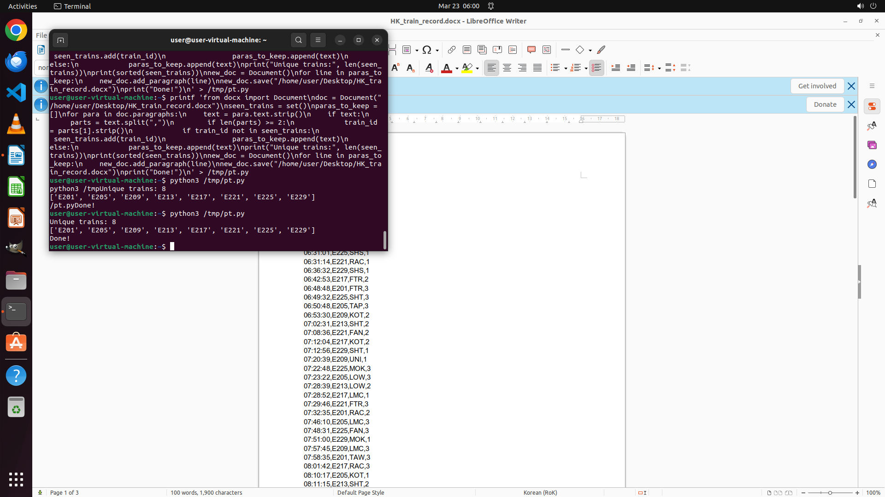

# A certain railway company in Hong Kong uses a signaling system to keep track of trains in its railwa…

[← LibreOffice Writer](../README.md) · [← Showcase](../../README.md)

## Task

> A certain railway company in Hong Kong uses a signaling system to keep track of trains in its railway system. Each line in the docx file represents a train calling at a station from 0600 to 1200 on 2022-09-22, and has the following format: time_HH:MM:SS, train_id, station_id, platform_no.. I want to remove duplicated train ids in order to know how many different trains are running from 0600 to 1200. Could you help me on this? I am doing it manually and it is very inefficient.

## Final state

## Artifacts

- [▶ Screen recording](recording.mp4) — full agent run
- [Trajectory](traj.jsonl) — per-step actions, reasoning, and screenshots
- [Runtime log](runtime.log)
- [Task definition](task.json) — original OSWorld task config
- Step screenshots: `step_*.png` in this folder

Task ID: `6f81754e-285d-4ce0-b59e-af7edb02d108` · Domain: `libreoffice_writer` · Source: `https://superuser.com/questions/789473/remove-duplicate-lines-in-libreoffice-openoffice-writer`
