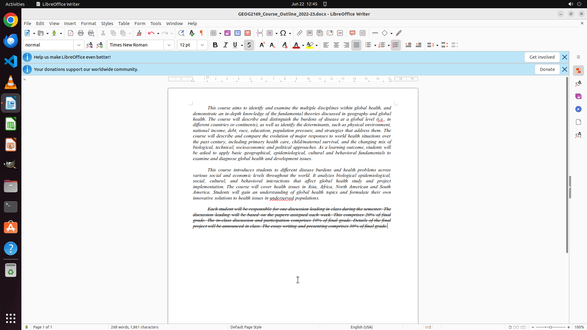

# I am peer-reviewing my friend's course outline. I think the last paragraph is redundant so I want to…

[← LibreOffice Writer](../README.md) · [← Showcase](../../README.md)

## Task

> I am peer-reviewing my friend's course outline. I think the last paragraph is redundant so I want to add strike-through on words in the last paragraph. Can you do this for me?

## Final state

## Artifacts

- [Trajectory](traj.jsonl) — per-step actions, reasoning, and screenshots
- [Runtime log](runtime.log)
- [Task definition](task.json) — original OSWorld task config
- Step screenshots: `step_*.png` in this folder

Task ID: `72b810ef-4156-4d09-8f08-a0cf57e7cefe` · Domain: `libreoffice_writer` · Source: `https://superuser.com/questions/657792/libreoffice-writer-how-to-apply-strikethrough-text-formatting?rq=1`
