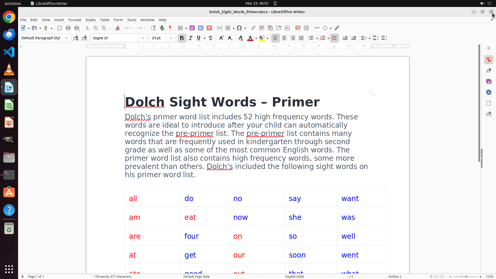

# I am writing a word list for a dyslexic kid. To ease things for him, I want to use red for words sta…

[← LibreOffice Writer](../README.md) · [← Showcase](../../README.md)

## Task

> I am writing a word list for a dyslexic kid. To ease things for him, I want to use red for words start with vowels and blue for those start with non-vowels. Can you do this for me? I'm doing it manually, and it is a pain.

## Final state

## Artifacts

- [▶ Screen recording](recording.mp4) — full agent run
- [Trajectory](traj.jsonl) — per-step actions, reasoning, and screenshots
- [Runtime log](runtime.log)
- [Task definition](task.json) — original OSWorld task config
- Step screenshots: `step_*.png` in this folder

Task ID: `8472fece-c7dd-4241-8d65-9b3cd1a0b568` · Domain: `libreoffice_writer` · Source: `https://stackoverflow.com/questions/37259827/libreoffice-writer-how-to-set-different-colors-to-each-letter`
