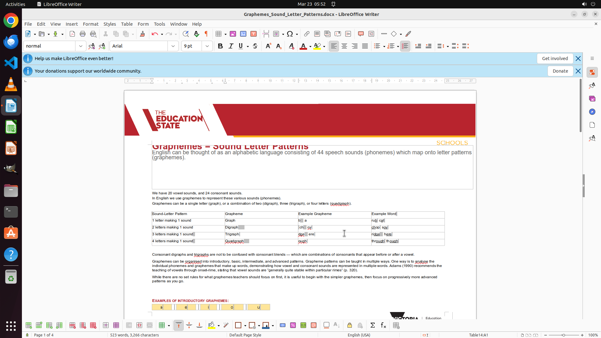

# Could you help me convert the text seperated by commas to a table?

[← LibreOffice Writer](../README.md) · [← Showcase](../../README.md)

## Task

> Could you help me convert the text seperated by commas to a table?

## Final state

## Artifacts

- [▶ Screen recording](recording.mp4) — full agent run
- [Trajectory](traj.jsonl) — per-step actions, reasoning, and screenshots
- [Runtime log](runtime.log)
- [Task definition](task.json) — original OSWorld task config
- Step screenshots: `step_*.png` in this folder

Task ID: `936321ce-5236-426a-9a20-e0e3c5dc536f` · Domain: `libreoffice_writer` · Source: `https://www.youtube.com/watch?v=l25Evu4ohKg`
