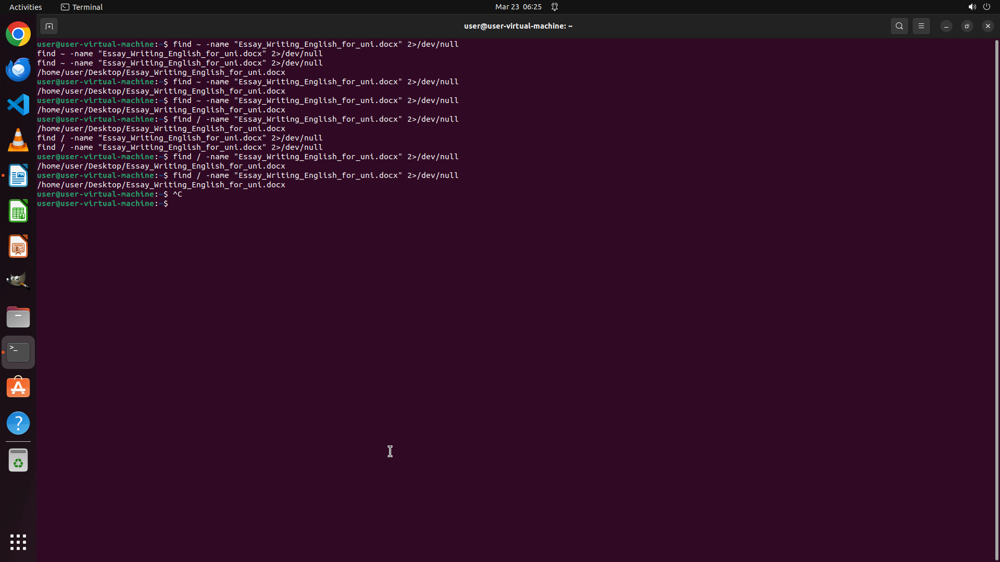

# Help me adding "Steinberg, F. M., Bearden, M. M., & Keen, C. L. (2003). Cocoa and chocolate flavonoi…

[← LibreOffice Writer](../README.md) · [← Showcase](../../README.md)

## Task

> Help me adding "Steinberg, F. M., Bearden, M. M., & Keen, C. L. (2003). Cocoa and chocolate flavonoids: Implications for cardiovascular health. Journal of the American Dietetic Association, 103(2), 215-223. doi: 10.1053/jada.2003.50028" to my reference list, and add a cross reference (using reference number) in the fourth paragraph where I marked "<add here>".

## Final state

## Artifacts

- [▶ Screen recording](recording.mp4) — full agent run
- [Trajectory](traj.jsonl) — per-step actions, reasoning, and screenshots
- [Runtime log](runtime.log)
- [Task definition](task.json) — original OSWorld task config
- Step screenshots: `step_*.png` in this folder

Task ID: `adf5e2c3-64c7-4644-b7b6-d2f0167927e7` · Domain: `libreoffice_writer` · Source: `https://seekstar.github.io/2022/04/11/libreoffice%E5%BC%95%E7%94%A8%E6%96%87%E7%8C%AE/`
