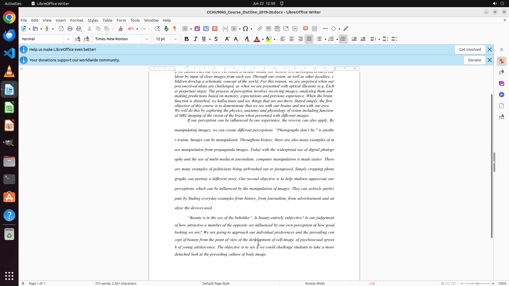

# I have been practicing professional writing lately. Now I am writing essay which requires one paragr…

[← LibreOffice Writer](../README.md) · [← Showcase](../../README.md)

## Task

> I have been practicing professional writing lately. Now I am writing essay which requires one paragraph each for introduction, body and conclusion with single-space for introduction, double-space for body then one-and-a-half-space for conclusion. The font size of this essay is 12. Could you help me on this?

## Final state

## Artifacts

- [Trajectory](traj.jsonl) — per-step actions, reasoning, and screenshots
- [Runtime log](runtime.log)
- [Task definition](task.json) — original OSWorld task config
- Step screenshots: `step_*.png` in this folder

Task ID: `b21acd93-60fd-4127-8a43-2f5178f4a830` · Domain: `libreoffice_writer` · Source: `https://superuser.com/questions/1097199/how-can-i-double-space-a-document-in-libreoffice?rq=1`
