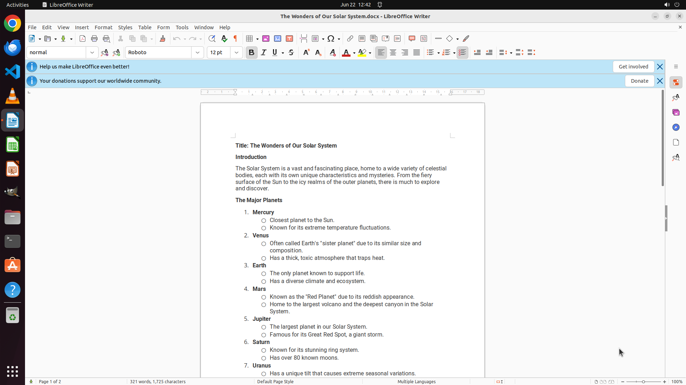

# Share this document with my team and let us edit it together in real-time.

[← LibreOffice Writer](../README.md) · [← Showcase](../../README.md)

## Task

> Share this document with my team and let us edit it together in real-time.

## Final state

## Artifacts

- [Trajectory](traj.jsonl) — per-step actions, reasoning, and screenshots
- [Runtime log](runtime.log)
- [Task definition](task.json) — original OSWorld task config
- Step screenshots: `step_*.png` in this folder

Task ID: `bb8ccc78-479f-4a2f-a71e-d565e439436b` · Domain: `libreoffice_writer` · Source: `https://ask.libreoffice.org/t/can-lo-be-used-for-collaboration-multi-person-real-time-document-editing/9392/6`
