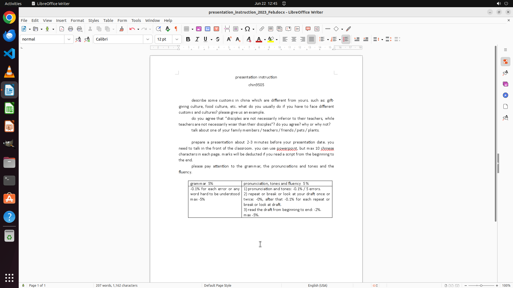

# I am currently engaged in text processing and require assistance in converting all uppercase text to…

[← LibreOffice Writer](../README.md) · [← Showcase](../../README.md)

## Task

> I am currently engaged in text processing and require assistance in converting all uppercase text to lowercase within my document. This precision is critical for maintaining a uniform and polished presentation. Could you help me on this?

## Final state

## Artifacts

- [Trajectory](traj.jsonl) — per-step actions, reasoning, and screenshots
- [Runtime log](runtime.log)
- [Task definition](task.json) — original OSWorld task config
- Step screenshots: `step_*.png` in this folder

Task ID: `d53ff5ee-3b1a-431e-b2be-30ed2673079b` · Domain: `libreoffice_writer` · Source: `https://ask.libreoffice.org/t/how-to-convert-all-uppercase-to-lowercase/53341`
