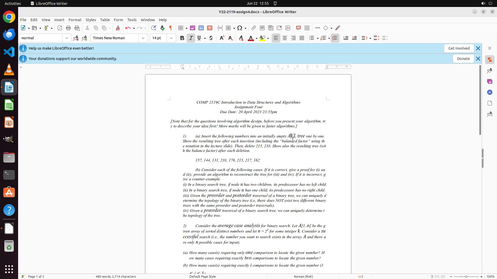

# I found Italic font very hard to discern from the normal text for me, as it is also dark black with …

[← LibreOffice Writer](../README.md) · [← Showcase](../../README.md)

## Task

> I found Italic font very hard to discern from the normal text for me, as it is also dark black with the same size. Current font size is 12 and I want to change the font size of italicized words to 14 to make it more discernible. Can you help me on this?

## Final state

## Artifacts

- [Trajectory](traj.jsonl) — per-step actions, reasoning, and screenshots
- [Runtime log](runtime.log)
- [Task definition](task.json) — original OSWorld task config
- Step screenshots: `step_*.png` in this folder

Task ID: `e246f6d8-78d7-44ac-b668-fcf47946cb50` · Domain: `libreoffice_writer` · Source: `https://ask.libreoffice.org/t/how-to-change-text-size-color-of-italic-font/77712`
