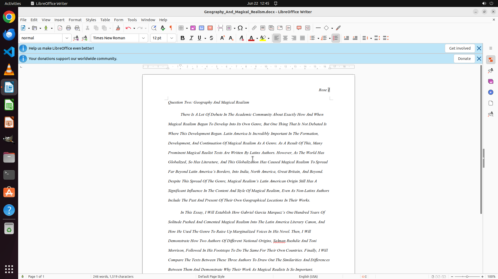

# Please help me make the first letter of each word to uppercase.

[← LibreOffice Writer](../README.md) · [← Showcase](../../README.md)

## Task

> Please help me make the first letter of each word to uppercase.

## Final state

## Artifacts

- [Trajectory](traj.jsonl) — per-step actions, reasoning, and screenshots
- [Runtime log](runtime.log)
- [Task definition](task.json) — original OSWorld task config
- Step screenshots: `step_*.png` in this folder

Task ID: `e528b65e-1107-4b8c-8988-490e4fece599` · Domain: `libreoffice_writer` · Source: `https://www.youtube.com/watch?v=l25Evu4ohKg`
