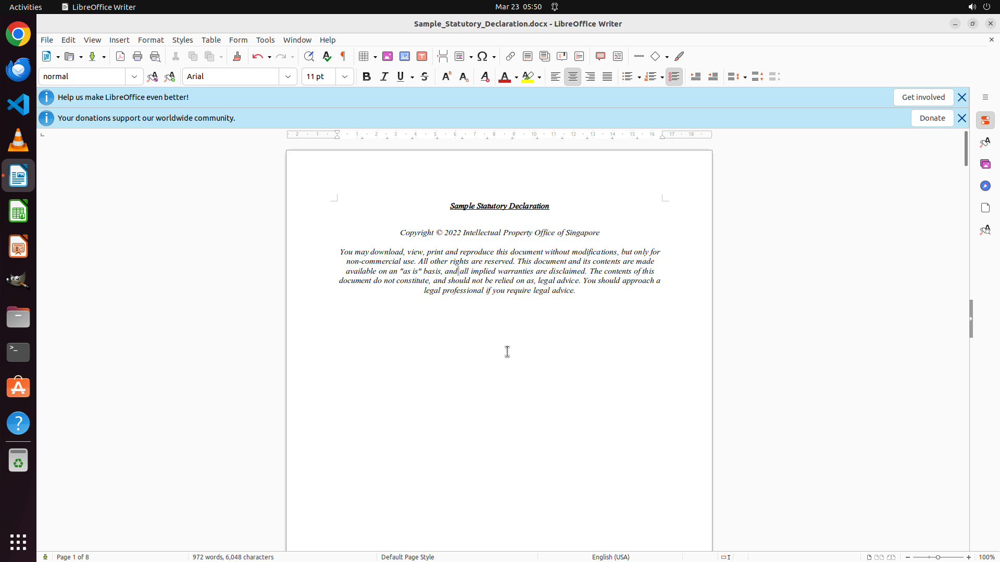

# Hey, can you throw in a blank page right after this one?

[← LibreOffice Writer](../README.md) · [← Showcase](../../README.md)

## Task

> Hey, can you throw in a blank page right after this one?

## Final state

## Artifacts

- [▶ Screen recording](recording.mp4) — full agent run
- [Trajectory](traj.jsonl) — per-step actions, reasoning, and screenshots
- [Runtime log](runtime.log)
- [Task definition](task.json) — original OSWorld task config
- Step screenshots: `step_*.png` in this folder

Task ID: `ecc2413d-8a48-416e-a3a2-d30106ca36cb` · Domain: `libreoffice_writer` · Source: `https://www.quora.com/How-can-I-insert-a-blank-page-on-libreoffice`
